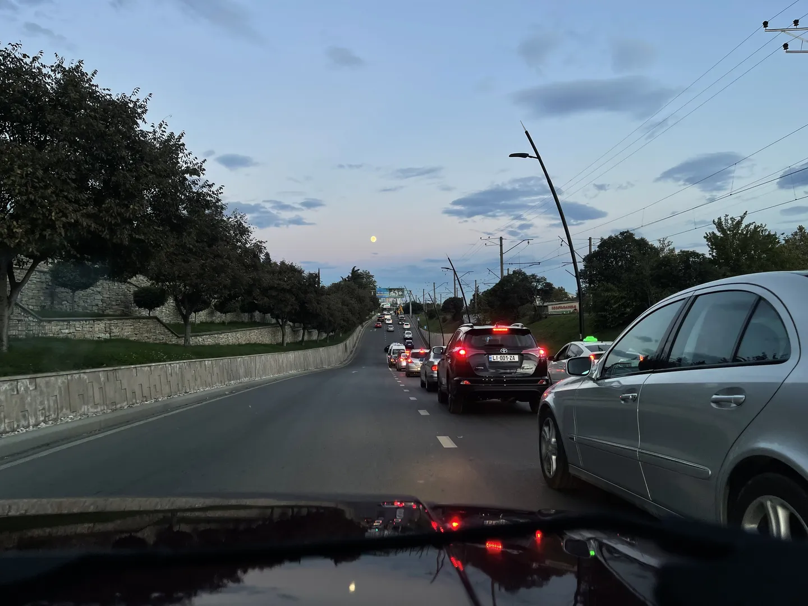
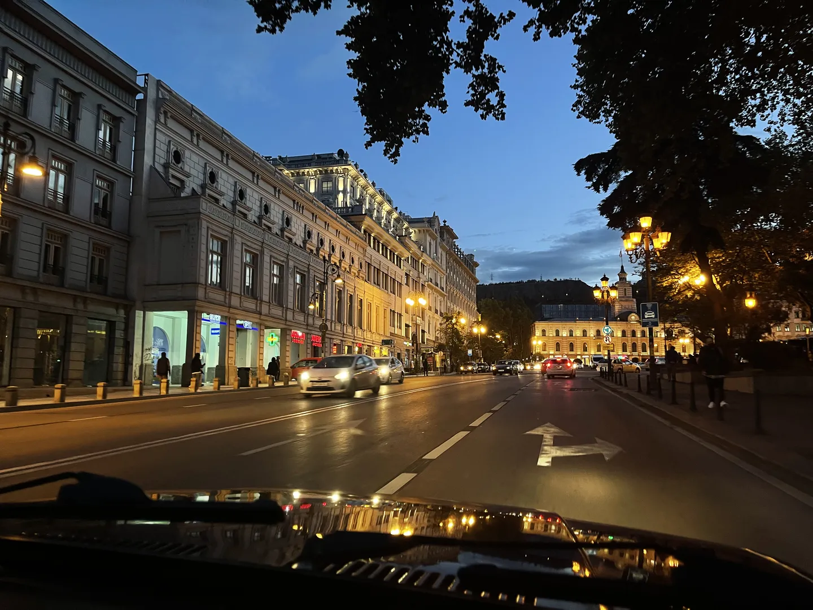
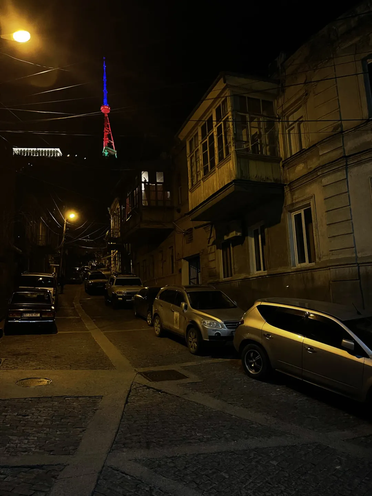
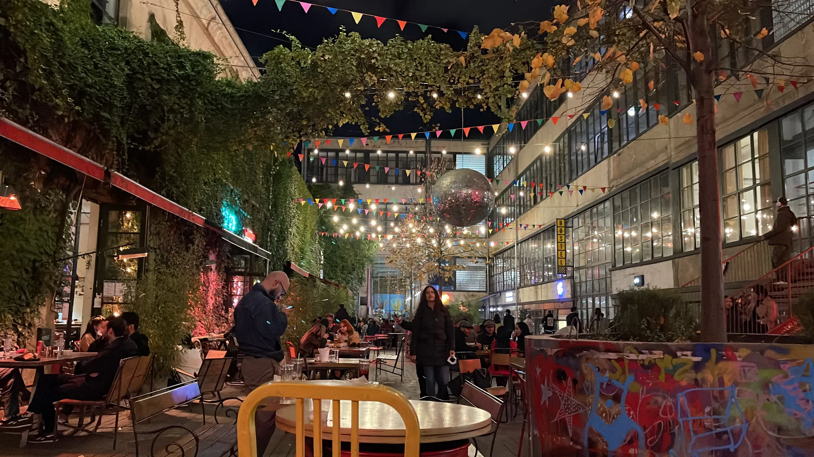
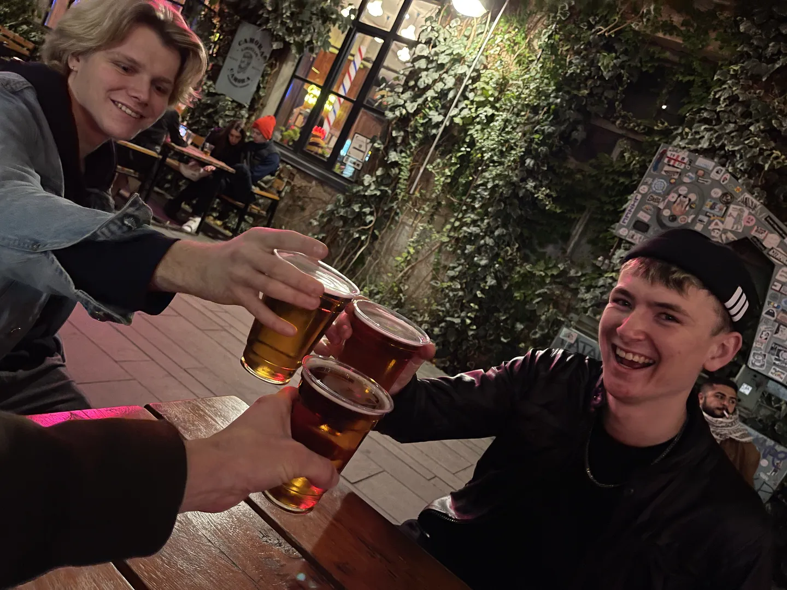

Georgië, een land waarvan je de naam wel eens hoort, maar welke je niet zomaar even op de kaart kan aanwijzen. Wanneer twee vrienden besluiten om een half jaar te gaan studeren in Tbilisi, de hoofdstad van Georgië, is de interesse gewekt. Een maand voor vertrek heb ik de knoop doorgehakt en een vliegticket geboekt. Ik ga twee weken Georgië ontdekken met de twee beste gidsen die je je kan wensen, Sven en Rikus!

Mijn reis naar Georgië is de voornaamste reden dat ik - eindelijk - de tijd heb genomen om een blog op te zetten. Het zelfvernoemde adres lag al jáááren te verstoffen. Omdat ik tegenwoordig de meeste socialemedia links laat liggen, blijkt het lastiger om het thuisfront mee te laten genieten. Een goede aanleiding dus hier wat moeite in te steken.

Het bovenstaande vliegtuig van Georgian Airways heeft me na 4,5 uur vliegen op het vliegveld van Tbilisi gebracht. Onderweg was het heel bewolkt, maar toen de daling werd ingezet werd ik getrakteerd op een prachtig ruig landschap in de schemering van de aangebroken avond. Een mooie kennismaking met de hoofdstad waar ik het grootste deel van deze twee weken zal verblijven.

Bij aankomst werd ik opgewacht door Sven en Rikus. Het was heel fijn om die twee na twee maanden weer te zien. Na een korte omhelzingsronde wachtte mij het eerste avontuur al op: een ritje met de Lada die de jongens hebben aangeschaft. Het rooie Sovjet-bakkie was een perfecte kennismaking met Georgië: ruig, niet perfect, maar wel vol charme!

Na een ritje van zo'n twintig minuten door de stad kwamen we aan bij het appartement. Deze is gelegen in de wijk ძველი თბილისი (dzveli t'bilisi), wat staat voor Oud Tbilisi. Dit is een van de oudste wijken van de stad en is daarom erg gunstig gelegen naast het oude centrum van de stad. Dat betekent dat er veel te doen is op loopafstand! Niet dat dat anders een probleem zou zijn. Een taxi brengt je omgerekend voor zo'n twee euro naar de andere kant van de Tbilisi.

Sven had om 8 uur 's avonds een examen (de schooltijden zijn hier een beetje afwijkend), dus zijn Rikus en ik naar de stad gelopen om bij een Italiaans restaurant te eten. Een diner voor twee man met twee gangen kostte ongeveer 20 euro! Na het heerlijke maal hebben we een taxi besteld en zijn we naar Fabrika (ფაბრიკა) gegaan. Dit is een pleintje omringd door een oud fabrieksgebouw waarin zich allemaal kroegjes bevinden. Dit is een van de hotspots voor de studenten uit de stad. Het bier is ook niet zo duur, 4 Georgische Lari voor een halve liter, wat neerkomt op iets meer dan een euro. Lekker doordrinken dus.

Helaas zijn er nog heel wat covidrestricties in het land actief, wat betekende dat we om 11 uur van het plein moesten vertrekken. Gelukkig was de avond nog niet voorbij. De jongens wisten namelijk van een geheime club in de buurt. Eenmaal daar aangekomen was het inderdaad niet te zien dat er een club verstopt zat achter een doodnormale voordeur. De grote groep rokende mensen voor de deur verklapte wel een beetje dat er wat interessants zou moeten zijn. Eenmaal binnen bleken we meteen de laatste biertjes (in blik) besteld te hebben. Heel vervelend, want nu waren we op de cocktails aangewezen ;). Maar ach, voor de prijs van een rondje kan je er in Amsterdam niet eens ééntje bestellen.

