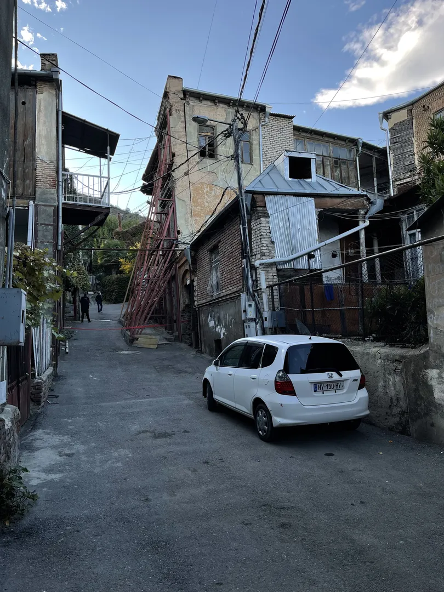
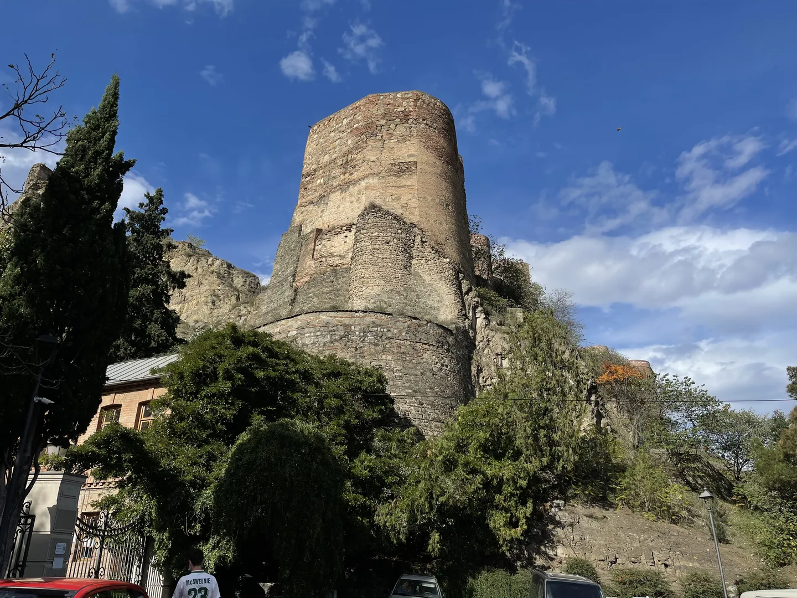
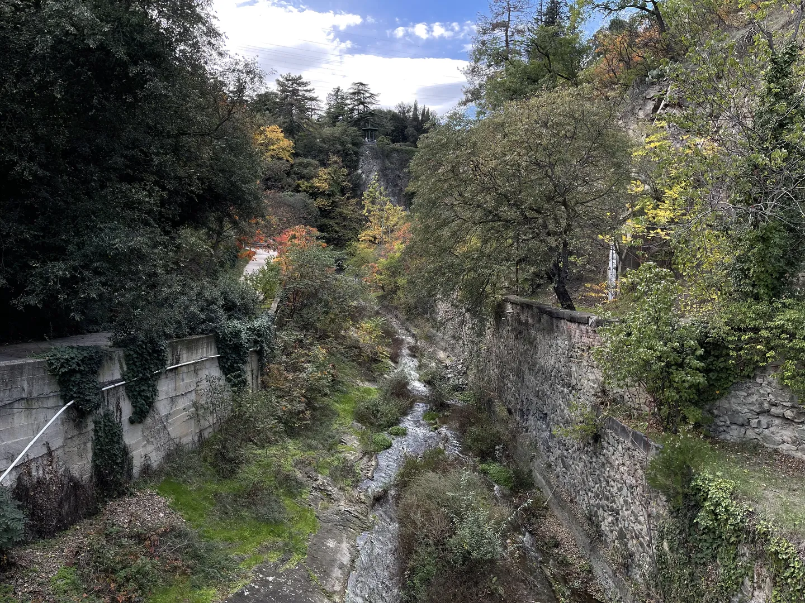
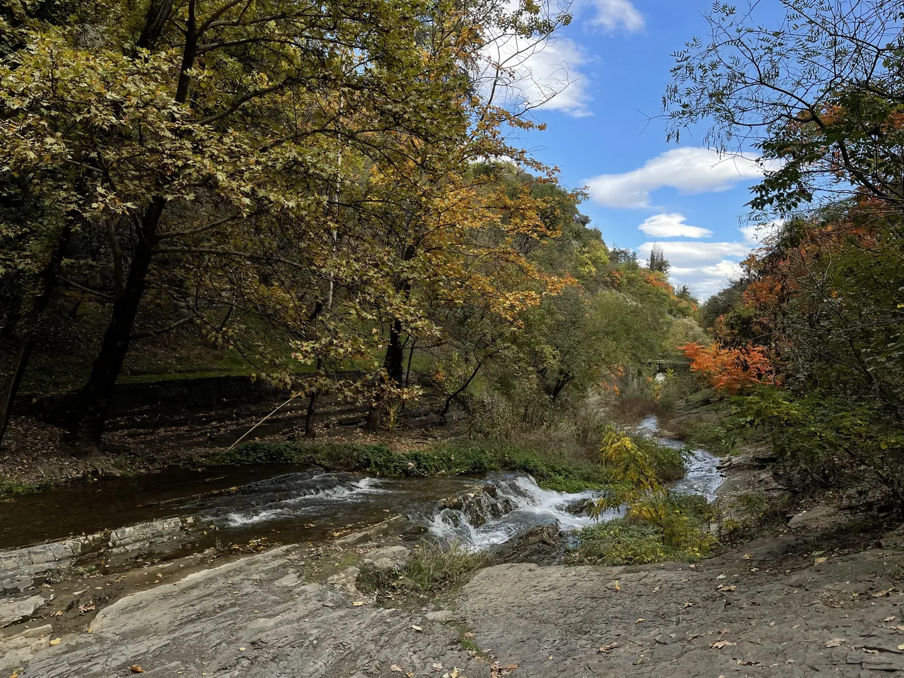
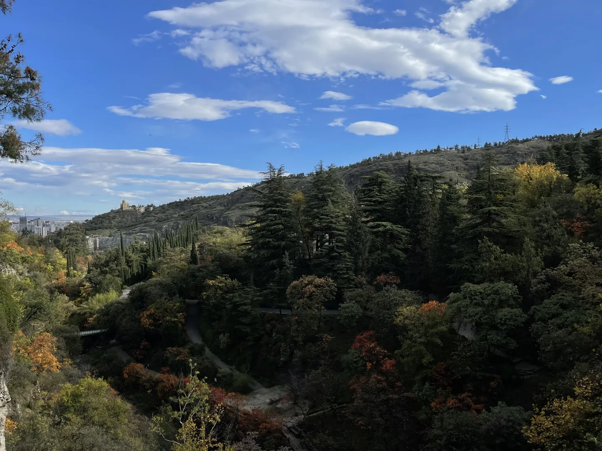
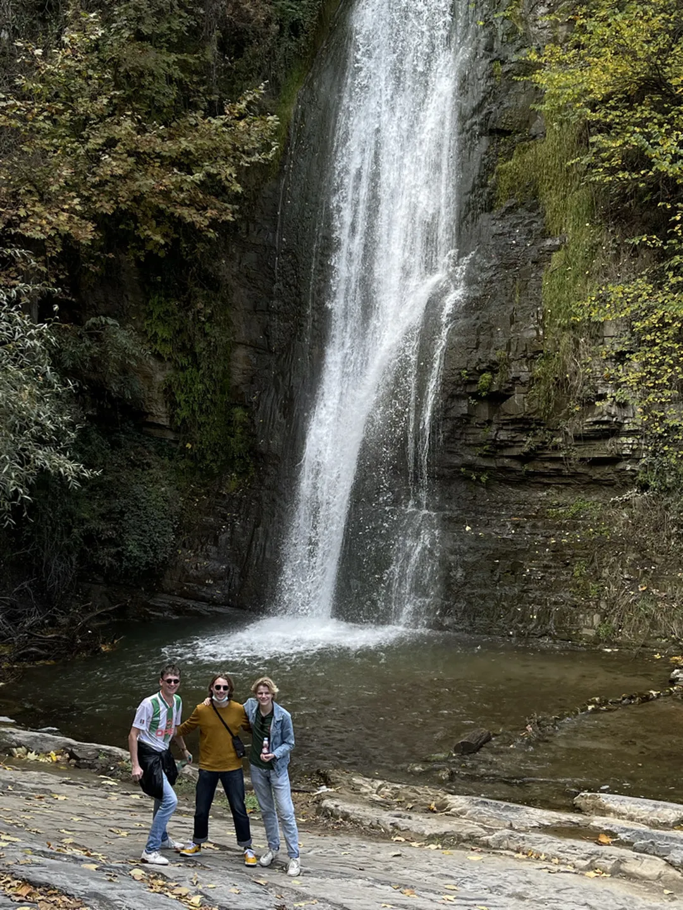
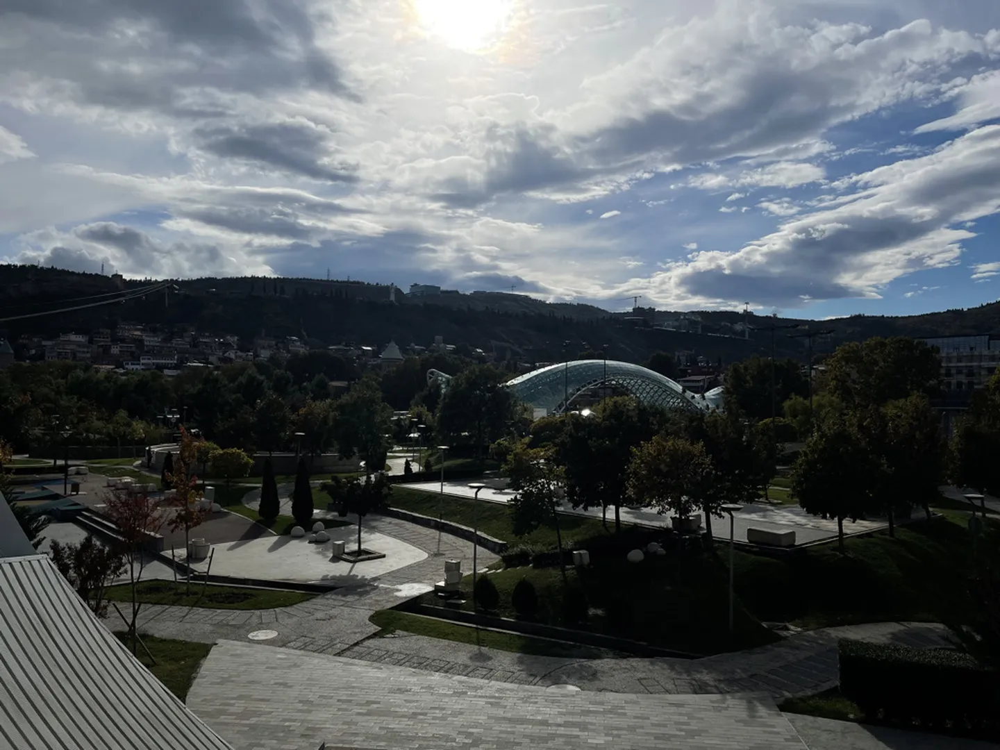
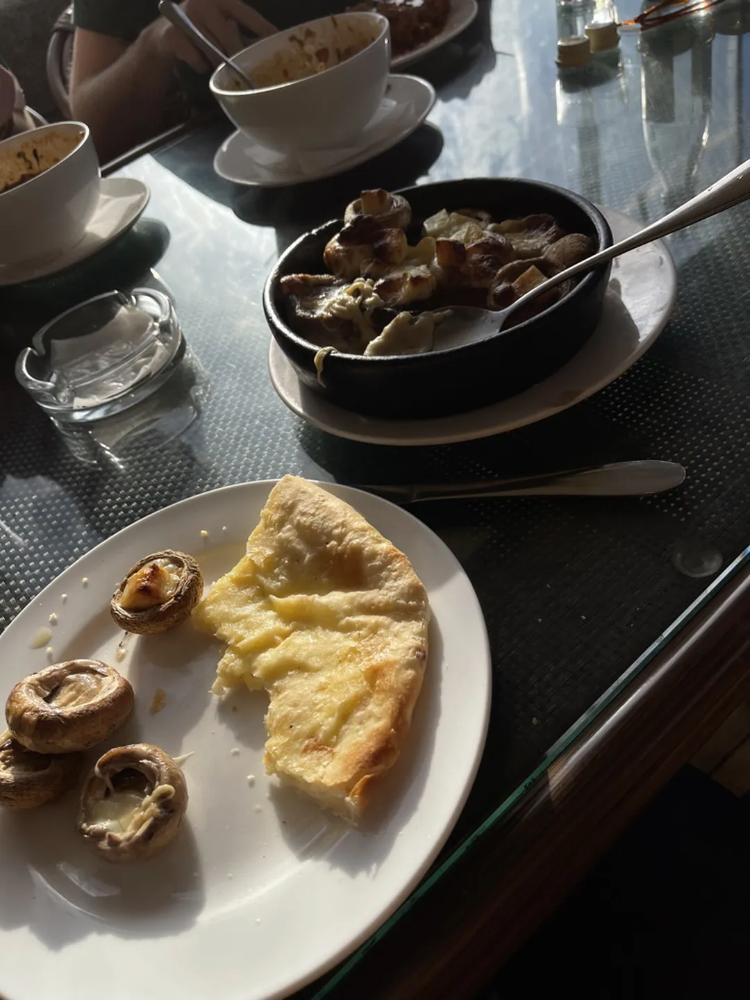
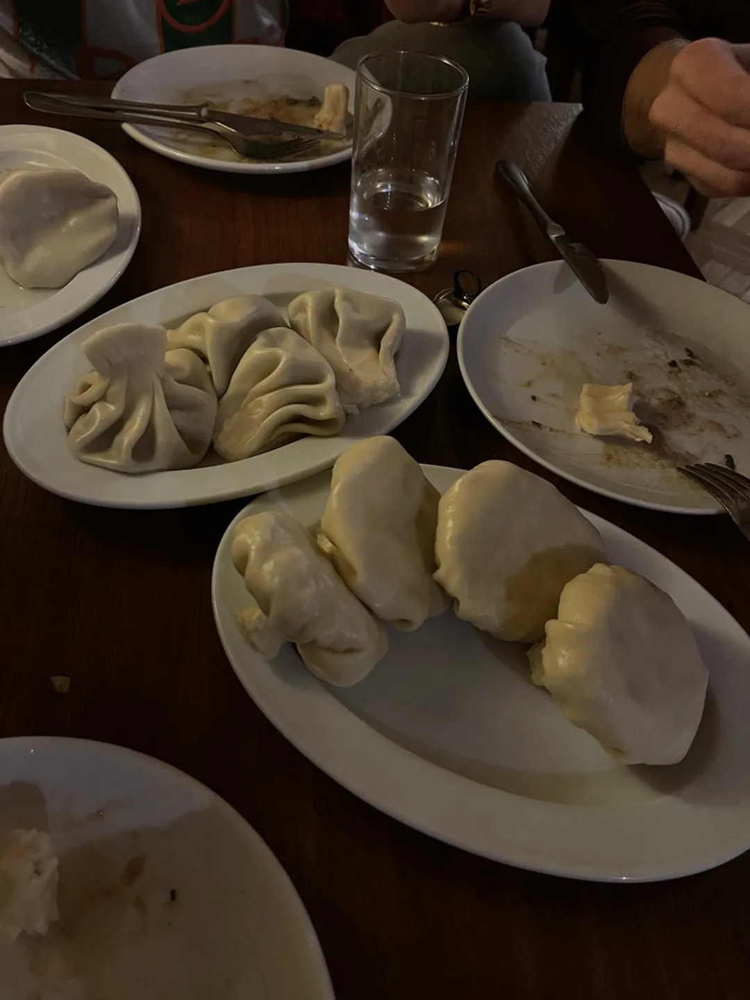
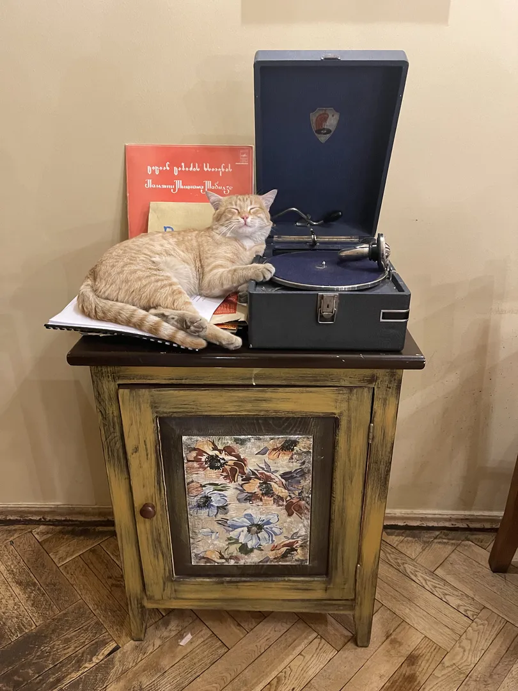

Het blijkt nog een beetje wennen aan het tijdsverschil van twee uur, want ik werd pas rond 12 uur wakker. Met andere woorden, ik heb heerlijk geslapen. Vandaag gaan Rikus en Sven mij de omgeving van het appartement laten zien. Dat is eigenlijk meteen het centrum van de stad en er is dus genoeg te zien. Lopend door de straten valt er echt van alles op. De meeste huizen en gebouwen zijn in slechte staat. Het is duidelijk dat de Georgische bouwstandaarden niet zo strict zijn als in Nederland. Kabels en pijpen worden op de vreemdste manieren aangebracht aan de gebouwen en elke aanbouw lijkt wel een hobbyproject van de bewoners. En als de constructie toch niet zo stevig blijkt als verwacht, dan zetten ze er gewoon een zootje stalen balken tegenaan. Het lukt mij echter niet om alle huizen even goed te bekijken, want je moet goed opletten waar je loopt. Voor je het weet verdwijn je in een donker trapgat, struikel je over een vreemd aangelegde stoep of stoot je je hoofd tegen een regenpijp. Het laat je wel beseffen dat al die regels in Nederland zo slecht nog niet zijn.

We maken een tocht omhoog, de berg op. Hier treffen we de botanische tuinen. Een prachtige plek met veel natuur en watervallen. En dat midden in een grote stad! Slingerend gaan we meerdere trappen op richting de top. Hier staat een gigantisch standbeeld van de "Mother of Georgia". Hier pakken we de kabelbaan terug naar beneden. Misschien een beetje eng gezien de toestand van de constructie, maar voor het uitzicht heb ik het wel over. Met de kabelbaan gaan we over een woonwijk heen en eindigen we in het Rike Park, pal onder het presidentieel paleis. Hier staat onder andere een grote concertzaal, welke nooit in gebruik is genomen maar wel erg imposant overkomt met zijn rare vorm.

We lopen door een tunnel langs de brug naar de overkant van de rivier ..... en besluiten wat te gaan eten. Dit is mijn eerste kennismaking met de Georgische keuken. We eten een khachapuri (ხაჭაპური), wat ik zou omschrijven als een binnestebuiten pizza, omdat de kaas aan de binnenkant van het deeg zit. Daarnaast heb ik een kleien pannetje met champignons, die natuurlijk ook gevuld zijn met kaas. Het is goed te merken dat ze hier gek zijn op kaas. Het is allemaal erg lekker, alhoewel het best zwaar op de maag valt.

Na onze late lunch lopen we naar de Dry Bridge Market. Deze rommelmarkt is vernoemd naar de brug waarop deze zich bevindt. Hier verkopen ze echt de grootste verzameling zooi die je je kan voorstellen. Sovjet attributen, bijzondere munten, kapotte elektronica, oude boeken, zelfs alle soorten afstandbedieningen van de vorige eeuw. Je zal het maar net nodig hebben!

's Avonds besluiten we weer bij een restaurant in de buurt te gaan eten. Hier maak ik kennis met een andere grote liefde van de Georgiërs: wijn! Ze zijn er hier supertrots op dat ze al zeker 10.000 jaar wijn verbouwen. Ik moet zeggen, de rode huiswijn die ik dronk smaakte zeker bijzonder en was erg lekker. Het klinkt ietwat oneerbiedig, maar de smaak deed me denken aan de barbecuesaus van de McDonald's. Naast het drinken van wijn moet er natuurlijk ook wat gegeten worden. We bestellen een vijftiental khinkali's (ხინკალი), een typisch Georgisch gerecht. Dit is een deeggerecht wat is gekookt, eigenlijk een soort dumpling. De vulling kan vanalles zijn, zoals vlees, paddenstoel of aardappelpuree. Nadat ik een korte uitleg krijg hoe deze gegeten horen te worden eten we ons buikje rond.

