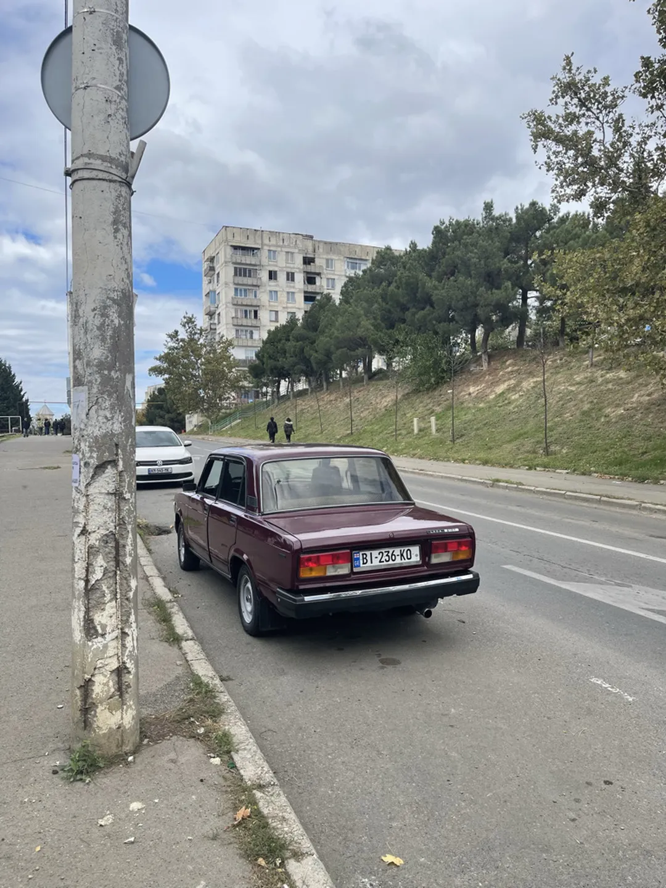
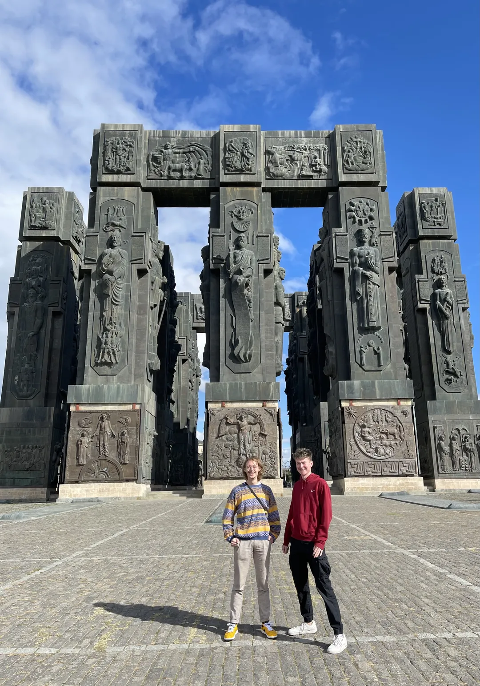
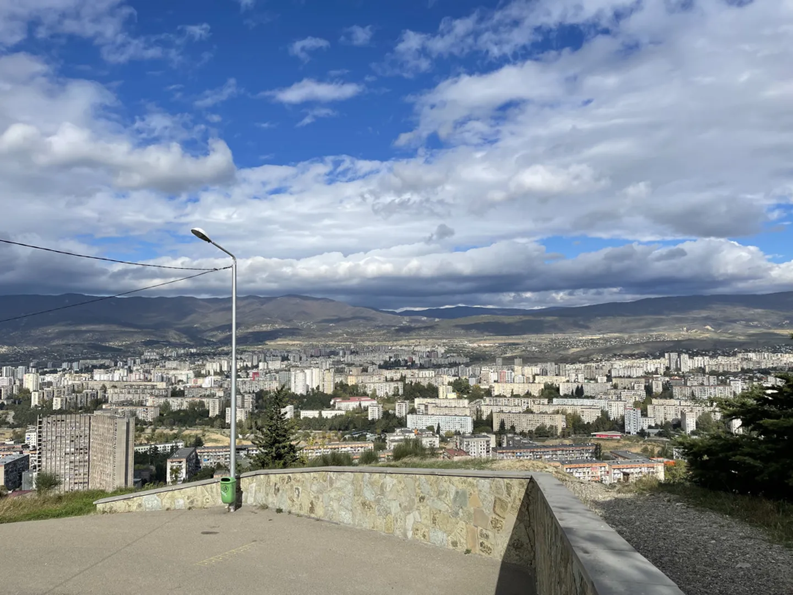
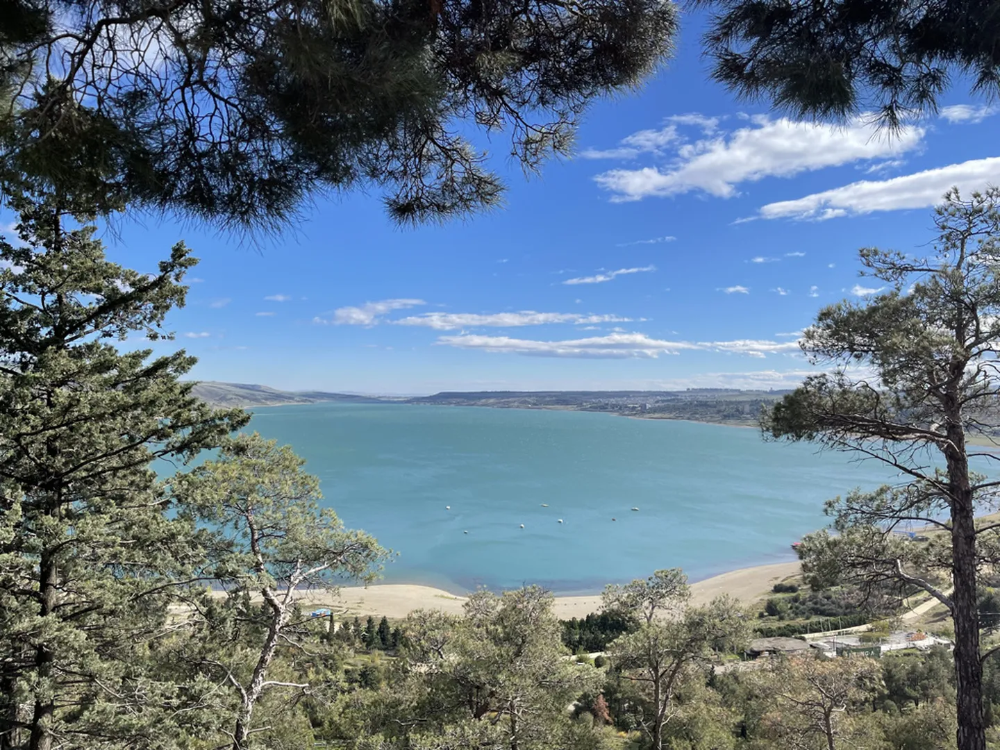
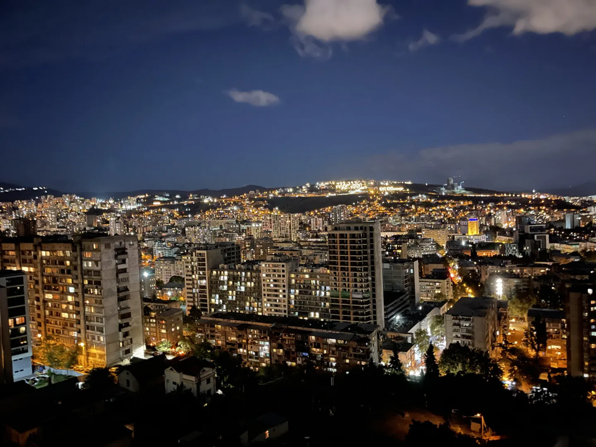

De geliefde Lada heeft een paar hele kleine mankementjes. Nadat eerder de accu was overleden hielden de sloten ermee op en kunnen de achterdeuren niet meer open. Het is natuurlijk niet zo handig om steeds over de stoelen te klimmen en op goede hoop de auto van het slot achter te laten. Gelukkig kon Sven via een Facebook-groep voor Lada-liefhebbers contact krijgen met een Georgiër die wel even wil helpen, tegen een kleine vergoeding. De dag begint daarom met een ritje naar het noord-westelijke deel van de stad.

Ik ga graag mee, want we moeten de hele stad doorkruisen om in de wijk te komen waar de man woont. Onderweg kom je weer de vreemdste taferelen tegen. Ten eerste heb ik nog nooit zoveel auto's zonder voorkant gezien. Ja, als je bumper beschadigd is en je gril valt er bijna af, dan gooi je die toch gewoon weg? Nergens voor nodig hier. Daarnaast lijken de banen op de weg vooral een suggestie en slalommen de auto's om je heen. Toch lijkt dit altijd gewoon goed te gaan. Soms steken mensen de snelweg over zonder te kijken en de auto's rijden er netjes omheen. Mij niet gezien hoor!

Wanneer we in de afgesproken wijk aankomen stuurt Sven onze locatie door. We bevinden zich midden in een (ik denk) oude sovjetwijk vol lelijke betonnen gedrochten. De grote hoeveelheid nu nog groene bomen zorgt voor een groot contrast en laat het gek genoeg toch best leefbaar ogen. De man waarmee we hebben afgesproken komt na een tijdje aangereden met zijn moeder. Na een half uurtje prutsen denkt hij te weten waar het probleem ligt en biedt ons aan om de juiste onderdelen te zoeken en deze vrijdag te installeren. Heel interessant om te zien hoe de Lada in elkaar zit, kort gezegd is het allemaal erg simpele mechaniek.

Nu we dan toch in deze hoek van de stad zijn rijden we naar de Chronicle of Georgia bovenaan een grote berg. Nu ik dit schrijf vraag ik me eigenlijk af of dit wel een berg is, want dat vinden wij Nederlanders al snel van een heuvel. Het monument is in de jaren '80 gebouwd ter ere van het tweeduizendjarige bestaan van Georgië. Het was er vrijwel uitgestorven en het monument is nooit afgemaakt en duidelijk slecht onderhouden. Zoals je op de foto bovenaan de pagina kan zien is het een overweldigende verschijning door de hoogte van het bouwwerk, zo'n 35 meter. Het uitzicht vanaf de berg zelf is ook indrukwekkend. Aan de ene kant zie je de Tblisi-zee (თბილისის ზღვა) liggen. Het helderblauwe water van dit kunstmatige waterreservoir deed het erg Mediterraans aanvoelen. Rond de andere kant van de berg kan je heel veel van de stad zien. Vooral de rijen na rijen na rijen aan betonnen flats vallen hier erg op.

Onderweg naar het appartement maken we nog een korte stop bij een winkelcentrum met een, jawel, Carrefour! Het was best gek om hier een enorme supermarkt te treffen met (uiteraard) Franse en Nederlandse tekst. Er worden in Georgië veel producten geïmporteerd uit Frankrijk en Duitsland en dat was hier goed te zien. Toch waren er ook wel wat Georgische eigenaardigheden, zoals een bar met wijntaps en grote bakken meel en andere bulkproducten waar je zelf uit mag scheppen.

De dag wordt afgesloten met een verjaardagsfeestje van iemand die Sven en Rikus kennen van de universiteit. Deze vind plaats op een hele bijzondere locatie, namelijk de penthouse van een flat midden in de stad. Vanaf hier heb je een prachtig uitzicht over de verlichte stad tussen de bergen. Ik keek echt m'n ogen uit! Omdat internationale studenten naar Georgische begrippen een ruime studiebeurs ontvangen zijn dit soort optrekjes opeens binnen handbereik, waar deze Duitse studenten goed gebruik van hebben gemaakt. Het was heel gezellig, bijna té, dus donderdag neem ik een rustdagje ;)

