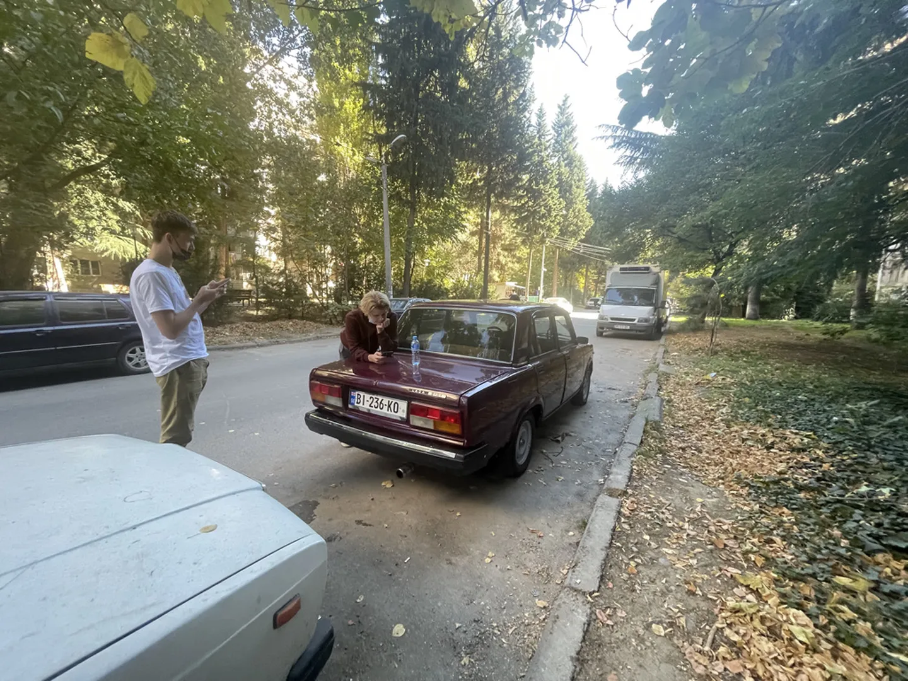
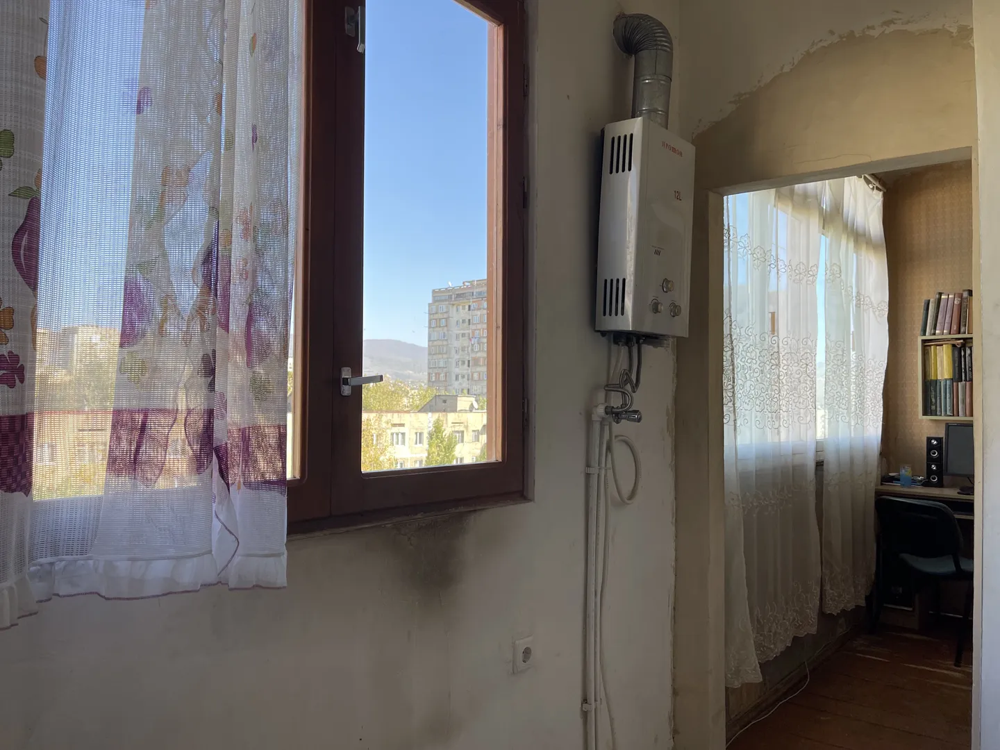
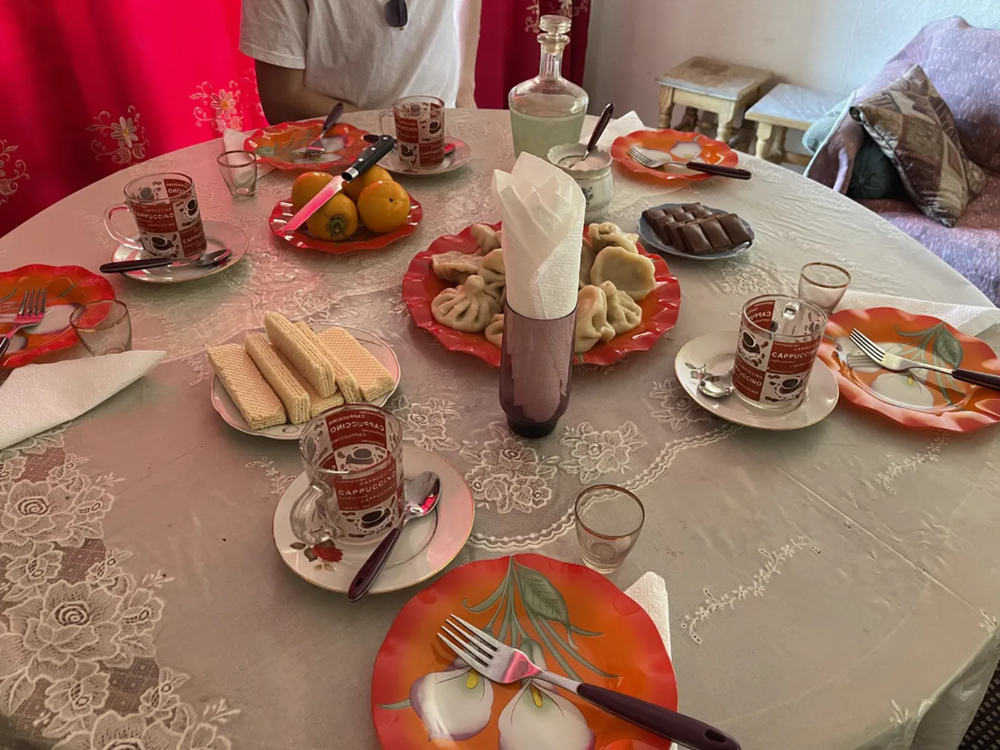
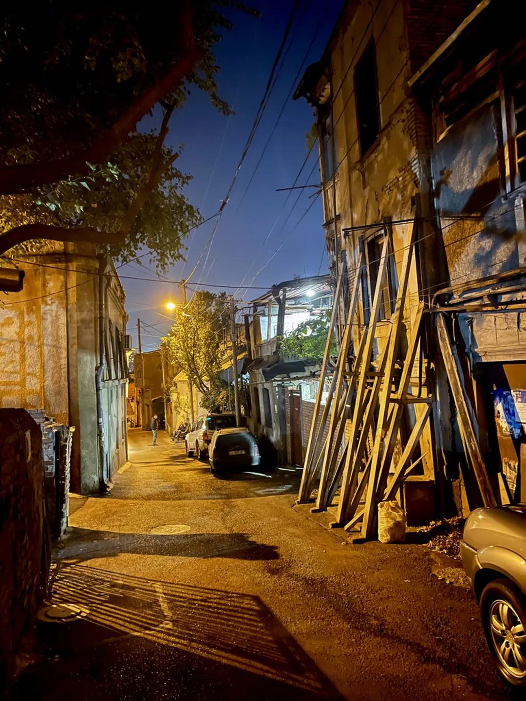

Vandaag was een hele bijzondere dag. Het begon met een afspraak met de man die aan de Lada kan sleutelen. We spreken af op dezelfde plek in het noord-westen van de stad. Terwijl hij bezig is met het vervangen van de sloten maken wij een ommetje door de wijk om geld te pinnen en ergens een broodje te scoren. We nemen de tijd, maar dit blijkt bij terugkomst niet genoeg om het af te ronden.

Als na een uur sleutelen Giorgi (wiens naam het Georgische equivalent van 'Jan' is) nog niet klaar is, vraagt hij ons om achter hem aan te rijden naar de wijk waar hij woont. Na een korte doolhofroute arriveren we tussen de sovjetflats in een enorm groene wijk. De vervallenheid van de flats wordt verbloemd door de natuur die hier lekker haar gang mag gaan. Het lijkt meer alsof je hier midden in een bos staat dan in een woonwijk.

Omdat het alsnog langer duurt dan verwacht wordt ons gevraagd om met zijn moeder naar hun appartement te gaan voor een lunch. Zo'n aanbod slaan we natuurlijk niet af, want we vinden het heel interessant om te zien hoe de lokale bevolking woont. We betreden aan de achterkant een van de hoge torens en stappen in een bizar klein liftje. Meer dan drie personen weigert de lift mee te nemen. Dat is waarschijnlijk maar goed ook. De lift ziet er namelijk ouder uit dan een jaar of veertig. De liften hier hebben ook een eigenaardigheid die we eerder ook al zagen. Om er gebruik van te maken moet er namelijk geld ingeworpen worden! Zo kan je ook wat doen aan overgewicht denk ik dan...

Op de tiende verdieping betreden we het appartement van Giorgi en zijn moeder. Het is best groot met meerdere kamers. De inrichting was sober en toch gezellig. Giorgi gaat weer aan de auto sleutelen en zijn moeder vraagt ons in de keuken plaats te nemen terwijl voor ons gaat koken. Ze heeft haar zoon een grote zak _khinkali's_ laten halen, lekker! We proberen een paar keer hulp aan te bieden, maar dat wordt beleefd afgeslagen. Wanneer het eten klaar is worden we gevraagd om in de woonkamer plaats te nemen aan de gedekte tafel. Giorgi is nog zo druk met de auto dat hij later aan zal sluiten.

Aan tafel krijgen we de bekende khinkalis voorgeschoven, allemaal gevuld met vlees. Normaliter eet ik geen vlees, maar vandaag maak ik een uitzondering. Weigeren zou ik namelijk erg onbeleefd vinden. Sowieso wist ik het Georgische woord niet voor nee, wat later weer zou blijken. Bij het eten krijgen we van Giorgi's moeder kleine glaasjes zelfgemaakte _chacha_ (ჭაჭა). Dit is een Georgische sterkedrank gemaakt met de pulp die overblijft bij het maken van wijn. Het blijkt gebruikelijk te zijn om lekker door te tikken bij de vrijdagmiddaglunch, want ze bleef maar voor me bijschenken. Rikus moest rijden en Sven nog studeren dus vooral ik was de Sjaak... Wist ik nou maar het Georgische woord voor nee!

De _khinkali_'s, citroenkoekjes en stukjes kakifruit smaken heerlijk. Als we toch echt wel heel vol beginnen te raken komt Giorgi gelukkig net binnen om ons met het eten te helpen. Inmiddels begin ik alle glaasjes _chacha_ toch wel te voelen. Om het nog even erger te maken wordt een grappig bedoelde opmerking van mij verkeerd begrepen door Giorgi. Die komt vervolgens aanzetten met een enorme karaf drank. Nog een klaarblijkelijk Georgisch gebruik is het mengen van wijn met _chacha_. Nu begint het toch wel een beetje uit de hand te lopen! Wanneer we huiswaarts gaan heb ik met Giorgi op ongeveer alle familieleden en beide landen geproost. We danken moeder en zoon hartelijk voor het heerlijke eten en de gezelligheid en rijden weer naar ons appartement.

Thuis heb ik het maar even opgezocht, nee is in het Georgisch _ara_ (არა).

