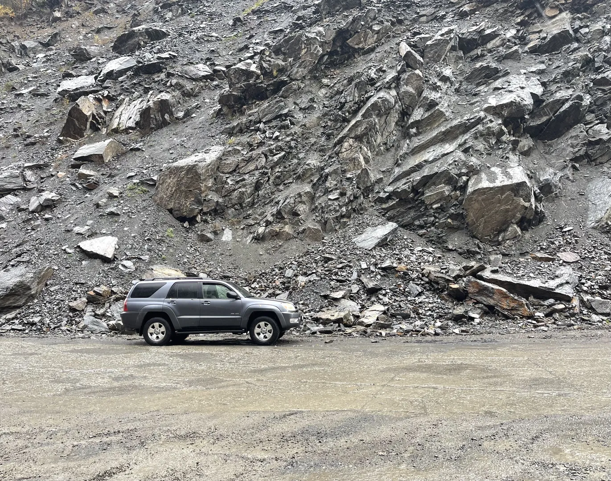
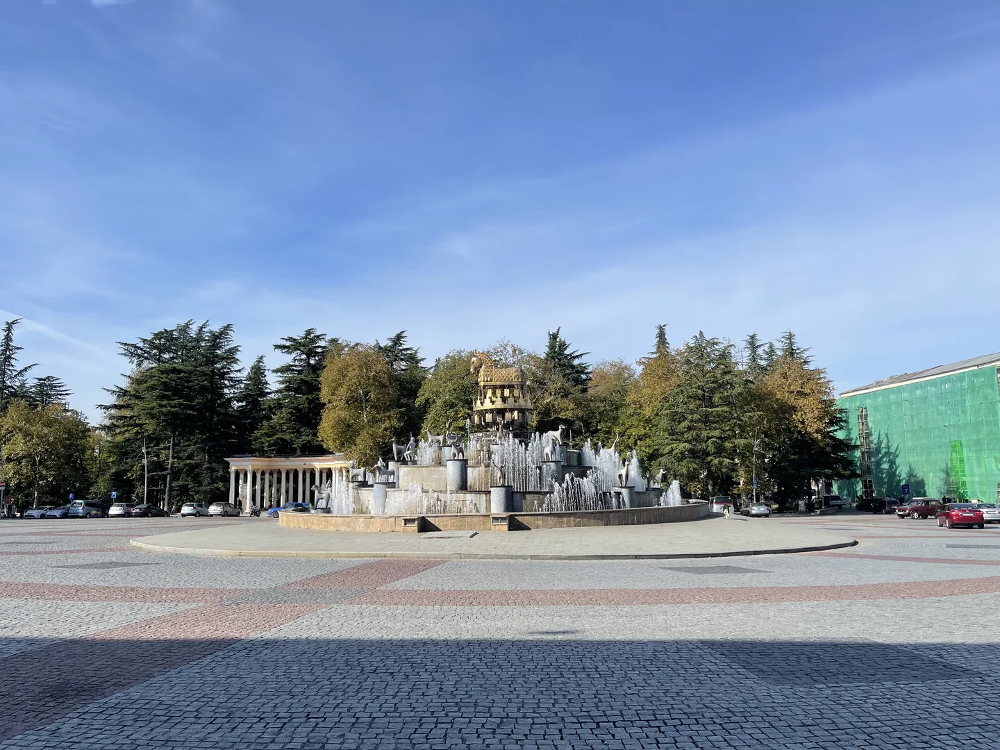
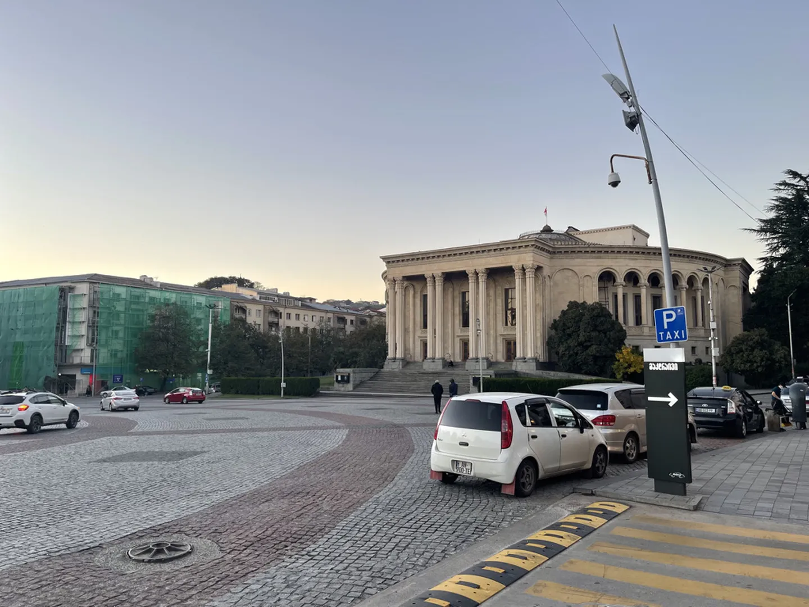

Zaterdag heb ik 's ochtends toch maar een simkaart gekocht voor mobiel internet. We gaan namelijk de bergen in en dan lijkt het me toch wel fijn om enigszins bereikbaar te zijn. Voor het geld maakt het in ieder geval niet uit, voor een week onbeperkt 4G betaal ik 8 lari, iets meer dan 2 euro.

We hebben een Toyota 4x4 gehuurd omdat het met de Lada niet te doen is in een weekend. We zijn van plan om te rijden richting Mestia. Dit ligt in het Kaukasus-gebergte in het noord-westen van Georgië. Het is de eerste keer dat ik Tblisi verlaat, voor de jongens is het inmiddels ook al een aantal weken geleden.

Het eerste deel van de rit is vooral een saaie autosnelweg met eindeloze bruingele vlaktes. Het valt op dat de landbouw erg kleinschalig is, de meeste akkers zijn niet groter dan een kwart voetbalveld. Ondertussen spelen we het spel _nieuwbouw of bouwval_. Door de manier waarop er hier gebouwd wordt is het soms totaal niet te zien wat het verschil is.

Onze eerste stop is de tweede stad van Georgië, Kutaisi. De stad heeft een hele andere sfeer dan Tblisi. De gebouwen en de straten lijken wat schoner, hoewel dat waarschijnlijk komt door het vele gebruik van wit steen. Dwars door de stad stroomt de rivier Rioni (რიონი) welke goed te zien is vanaf de vele bruggen die eroverheen lopen.

We eten ergens bij een lokaal restaurant met Georgische gerechten. Dit is ronduit een van de slechste keuzes tot nu toe! De bestelde gerechten worden in willekeurige volgorde naar de tafel gebracht en uiteindelijk waren ze mijn hoofdgerecht vergeten. Ik vond het ook een vreemde keus dat op de grote tv een tv-kanaal voor kinderen aanstond terwijl er geen kind in de zaak te bekennen was. Maar ach, de biertjes waren lekker en ik had genoeg salade en patat voor een verzadigd gevoel.

Ik weet niet hoe het komt, maar vandaag heb ik niet zoveel foto's genomen. Dit zal ik in de komende dagen helemaal goedmaken!
