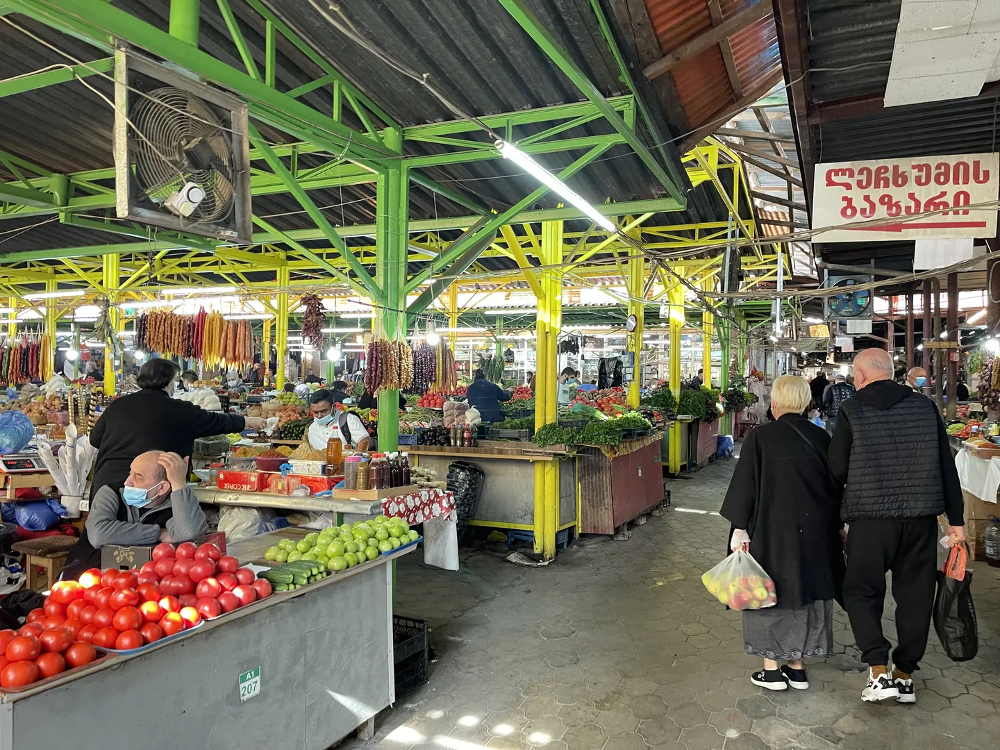
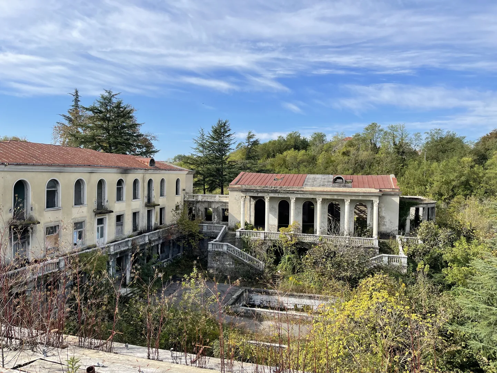

We slapen heerlijk in een AirBnB voor ongerekend tien euro en ontbijten in de buurt bij een café. Ik heb hier nog nooit zoveel moeite gehad met het voeren van bedelaars, want het was nu een bende katten met... kittens. Normaal worden we juist omsingeld door straathonden. Dat is overigens minder erg dan het klinkt, ze zijn namelijk allemaal super lief! Je kan aan een tag in hun oor ook zien dat ze zijn ingeënt tegen de bekende enge hondenziektes.

We lopen nog een rondje door de stad en bezoeken een enorme bazaar. Grote hallen en gangen gevuld met kraampjes en heerlijke geuren. Naast groente, fruit en kruiden vind je hier ook kleding, sieraden en andere troep. Wanneer we wat fruit aanschaffen krijgen we wat zelfgestookte _chacha_ en cognac te proeven. Die nemen we ook mee.

Onderweg stoppen we in Tskaltubo bij een van de vele verlaten sanitoria, _Sanitorium Medea_, een soort spa uit de sovjettijd. Tot de val van de Sovjet-Unie kwamen veel Russen naar dit gebied. We gaan deze ruïne verkennen. Heel spannend, want het is al jarenlang niet meer in gebruik en deels door de natuur ingenomen. Delen zijn ingestort, maar de vele voetafdrukken verklappen dat het nog stabiel genoeg is om een kijkje te nemen. We kunnen niet de hele ruïne bekijken. Het voormalige hotelgedeelte wordt namelijk grotendeels bewoond door vluchtelingen uit Abchazië. Dit westelijke deel van Georgië heeft zich in 2008 opnieuw onafhankelijk verklaard, onder "begeleiding" van Rusland.

We rijden verder de bergen in en passeren lange wegen welke vrijwel allemaal bewoond lijken. De lintdorpen in Nederland zijn hier niets bij. Toch doet het best Amerikaans ogen door de brede straten en grote voortuinen. Er loopt daarnaast enorm veel vee over de wegen. Ik denk dat ik in totaal meer koeien heb gezien dan in mijn hele leven in Nederland. Regelmatig staan ze in de weg en dan moet je maar even wachten tot ze aan de kant gaan.

De bergen komen steeds dichterbij. Aan het begin van het gebergte doemt de Enguri-dam op. Dit is de op twee na hoogste stuwdam van de wereld met 271 meter hoogte. Het oogt allemaal wat verlaten en ironisch genoeg vertelt het enige informatiebord meer over plannen voor toerisme dan over de dam zelf. Het helderblauwe water van het stuwmeer achter de dam steekt fel af tegen de enorme bergen.

We vervolgen de rit over een lange, hobbelige bergweg. Omdat het donker begint te worden besluiten we om te overnachten in het kleine dorpje Kaishi. Deze ligt naast de Patari Uguri-rivier, welke het stuwmeer voedt met het smeltwater uit het gebergte. Het zijn in totaal misschien twintig huisjes met een paar (vrijwel dezelfde) winkeltjes, maar het voelt een stuk levendiger dan alles wat we in de afgelopen uren hebben gezien. We reserveren een hotelkamer boven een van de winkeltjes en gaan op zoek naar een restaurant. Die hebben we in een hele bijzondere vorm gevonden. We hebben een salade met soep en brood gegeten in een soort opberghok van een oud vrouwtje. Het smaakte prima!

