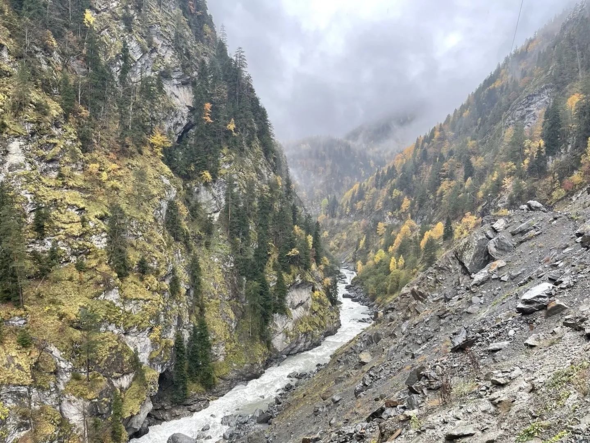

Voor het eerst sinds ik in Georgië ben, regent het. We worden wakker van het gekletter op het dak en besluiten snel in te pakken en voorlopig even te teren op een banaan. De rit die we vandaag willen afleggen is lang en we moeten natuurlijk ook nog het een en ander kunnen bekijken onderweg. Onze reis door de bergen wordt vervolgd.

De enige weg richting Mestia en de vele dorpjes onderweg is adembenemend prachtig. We slingeren tussen de machtige rotsformaties door. Door de zojuist ingetreden herfst begint een deel van de vele bomen goud-oranje te kleuren. Ondertussen verliezen we het blauwe water van de Patari Uguri-rivier vrijwel niet uit het oog. De kwaliteit van de weg is erg wisselend. Het grootste deel is netjes geasfalteerd met hier en daar een zinkgat. Op sommige plekken heeft het natuurgeweld van de bergen overwonnen en moeten we omleidingen trotseren en gevallen rotsblokken ontwijken. De 4x4 blijkt zeker geen overbodige luxe!

Na een paar uur beginnen de witte bergtoppen steeds dichterbij te komen, en lijken we de sneeuwgrens te passeren. Dat voelt best vreemd aan, gezien ik enkele dagen geleden nog temperaturen van rond de twintig graden op de huid voelde. We stappen een aantal keren uit om wat foto's te maken en stiekem ook om weer eens een keer sneeuw in de handen te hebben. Natuurlijk kunnen een paar sneeuwballen niet ontbreken.

Mestia blijkt op sommige punten zo van een Oostenrijkse postkaart te komen. Door het vele hout- en steengebruik in de architectuur doet het best als een Alpen-dorpje aanvoelen. We eten een hapje bij een restaurant en lopen een klein rondje door de stad. Heel eerlijk trekt de stad zelf ons niet zo, we zijn meer geïnteresseerd in de machtige natuur om ons heen. Sven heeft gelezen over een kabelbaan die ons nog veel hoger kan brengen, dus we besluiten onze weg daarnaartoe te vervolgen.

Eenmaal daar aangekomen blijkt de kabelbaan niet in werking te zijn, gezien deze wordt vervangen. Heel jammer, want ik keek uit naar het uitzicht vanaf boven. We laten ons niet zo snel uit het veld slaan en besluiten zo ver mogelijk de bergen in te rijden. Volgens de kaart gaat er een weg langs het vliegveld van Mestia richting een van de gletsjers in hogergelegen gebied. Hoe verder we op deze "weg" komen, hoe ruiger deze wordt. Langzaamaan verandert het in een soort grindpad vol kuilen en plassen. Zelfs de Belgen zouden dit geen weg durven noemen.

Eenmaal aan het einde van de "weg" treffen we een klein stuwmeer aan, waarvan ik denk dat deze gebruikt wordt voor de elektriciteitsvoorziening van de stad. We worden door een medewerker verzocht weg te gaan. Ik kan het niet laten om een gammele brug over te steken en nog even te proeven van het verse blauwe smeltwater. Net alsof ik uit een ijskoud flesje bronwater drink.

Nu we wel een beetje uitgekeken zijn, besluiten we weer dezelfde weg terug te nemen. De auto moet morgenmiddag namelijk weer ingeleverd worden. We rijden richting de stad Zagbibi, een tiental kilometer onder de bergketens van de Kaukasus. Over deze reis heb ik niet veel spannends te melden. In de stad eten we wat simpels bij de McDonald's (even wat anders na al dat Georgische voedsel) en boeken we een kamer in een luxe hotel. Morgen rijden we vrijwel dezelfde route terug naar Tbilisi.
