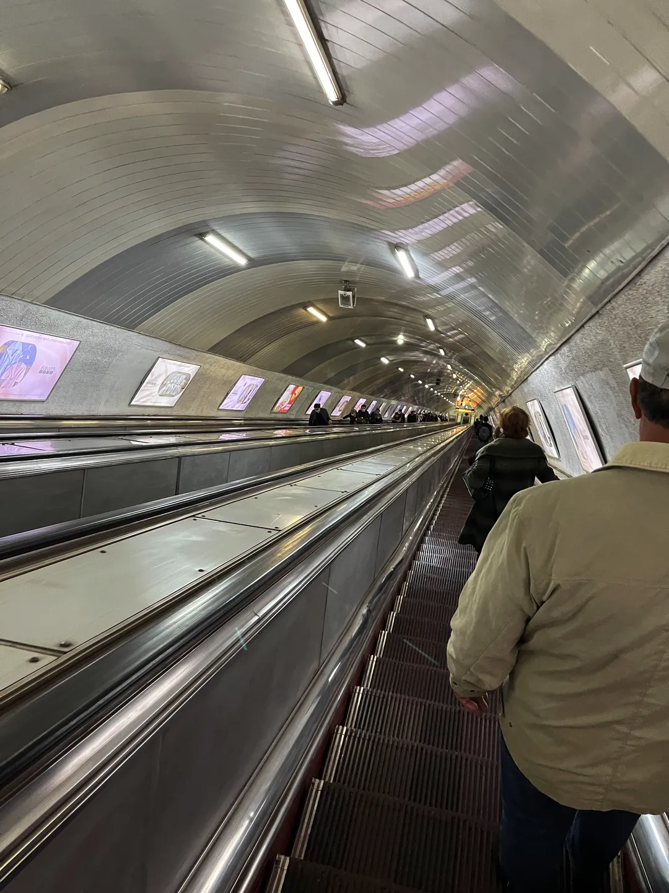
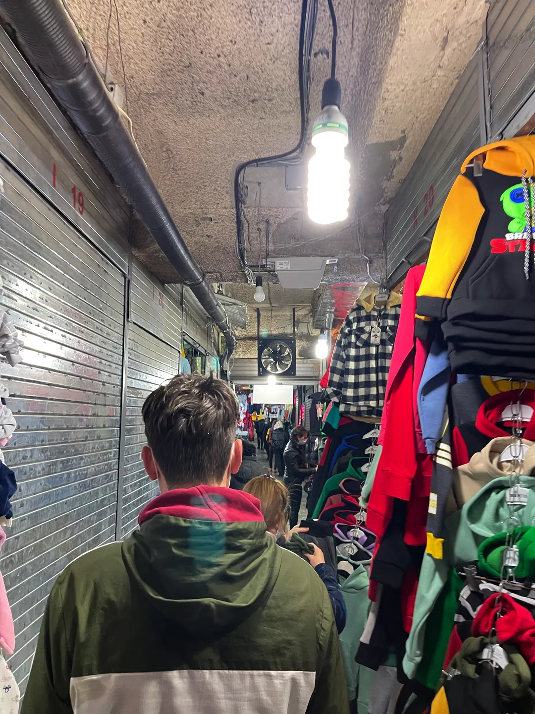
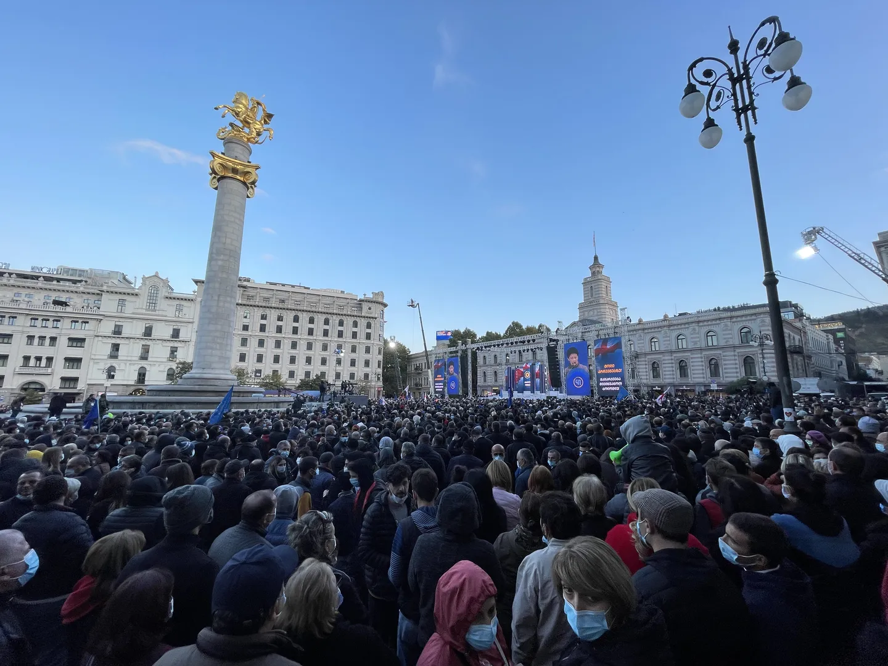
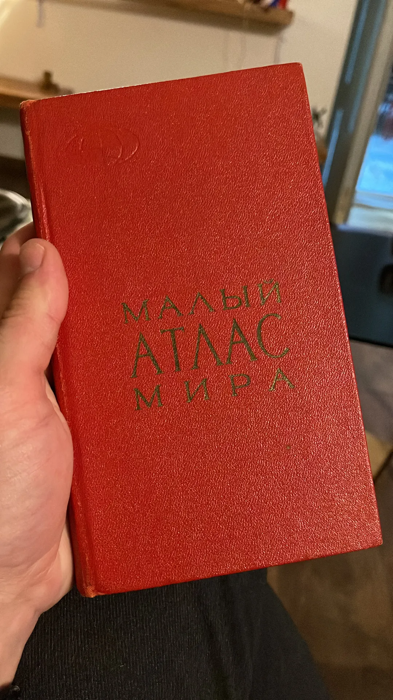
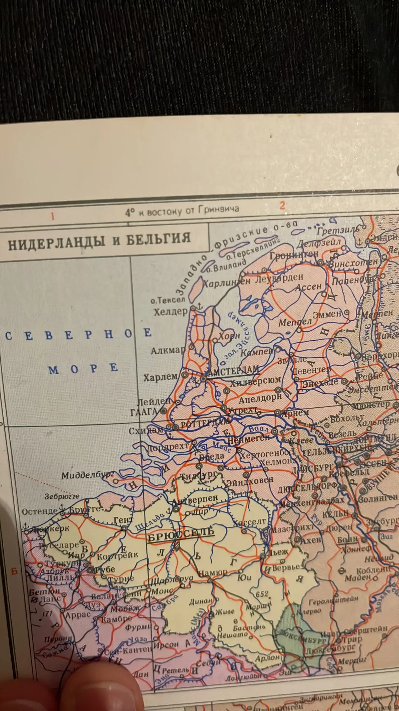

De laatste dagen zijn voorbij gevlogen! Dinsdag stond vooral in het teken van de reis terug naar Tbilisi. Na zo'n dagenlange reis was wat rust wel welkom.

Woensdag bracht ik een bezoek aan de bazaar in Tbilisi. Dit was meteen de eerste keer dat ik de metro van de stad heb gebruikt. Het is onvoorstelbaar dat deze in de jaren '60 is gegraven, vooral door de enorme diepte. Zoals op de foto te zien daal je bijna een halve kilometer af naar het station.

Aangekomen bij het stationsplein kan je via verschillende ingangen langs de straatkant de bazaar betreden. Hier daal je af in een gigantisch labyrint van smalle gangetjes met een groot aantal kleine stalletjes. Alles wat je nodig hebt kan je hier vinden, voornamelijk nepmerkkleding. Je moet er echt niet aan denken dat hier brand uitbreekt. Ondanks de verbodsbordjes werd er gewoon gerookt door de staleigenaren. Uiteindelijk scoor ik twee paar sokken.

Het viel op dat op de hoofdstraat van de stad alles was afgezet door politie en dat er meerdere podia werden opgezet met professionele geluidsapparatuur. 's Avonds bleek er een demonstratie van de leidende partij te zijn, als antwoord op een eerdere demonstratie van de oppositie. Natuurlijk is het meestal niet zo'n goed idee om je in het buitenland te mengen met de politiek, maar we besloten toch even een kijkje te nemen. Vanuit de gigantische mensenmassa hebben we zo toch nog even een glimp van de burgemeester opgevangen. Later bleek ook de president aanwezig te zijn. Helaas waren we al afgehaakt door het grote mannenkoor wat het volkslied kwam zingen.

Vandaag heb ik het Nationaal historisch museum bezocht. Het was een beetje raar opgezet. De begane grond ging heel diep in op de oertijd en de grote rol die het gebied van het huidige Georgië heeft gespeeld in de exodus van de mens van Afrika richting de rest van de wereld. In de Kaukasus zijn hier heel veel sporen van gevonden. Heel interessant! Daarna werd er een grote sprong gemaakt naar de Russische bezetting ten tijde van de Sovjet-Unie. Ook interessant, maar het verhaal was een beetje eenzijdig en bestond vooral uit heel veel documenten en notities zonder context. Het was in ieder geval wel duidelijk dat ze deze tijd als zeer negatief hebben ervaren.

Na een paar uur rondstruinen in het museum ben ik op zoek gegaan naar wat souveniertjes om mee naar huis te nemen. Ik ben niet zo van de prullaria, dus de standaard toeristenwinkeltjes heb ik linksgelaten. Uiteindelijk heb ik bij een straatkraampje een atlas gescoord uit 1970, uitgebracht ten tijde van de hoogtijdagen van de Sovjet-Unie. Een leuk aandenken aan deze geweldige twee weken!

