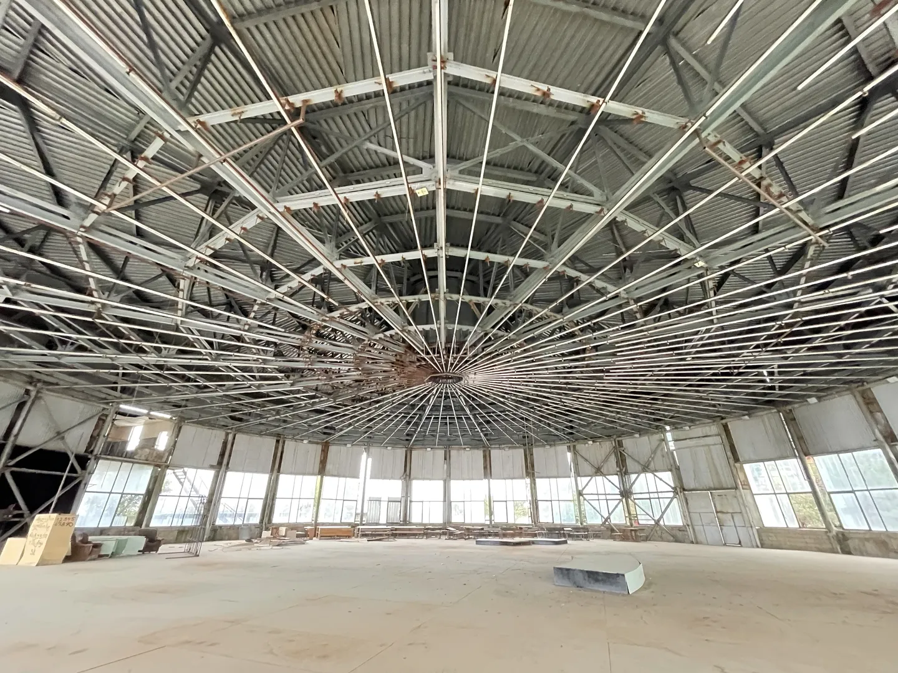
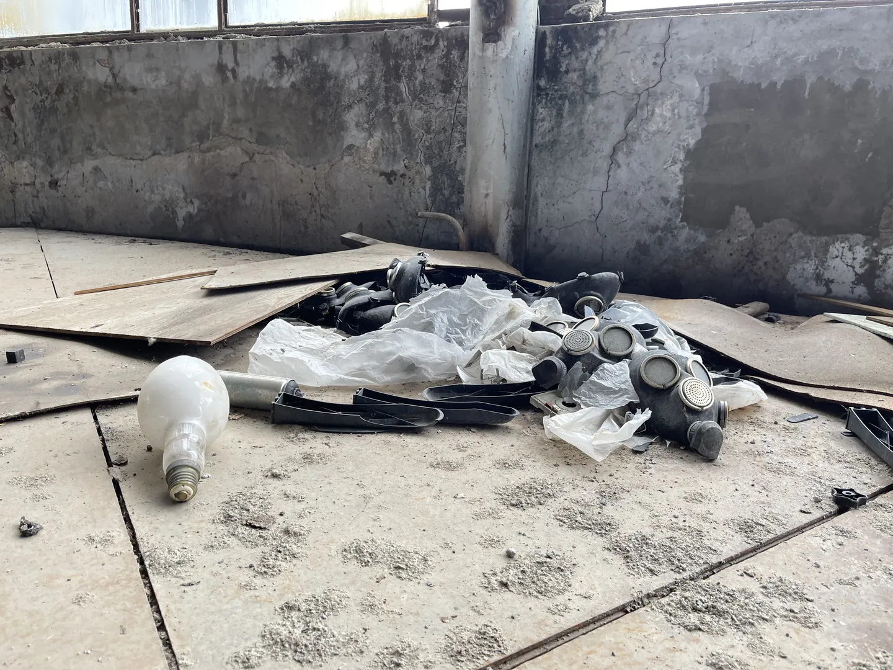
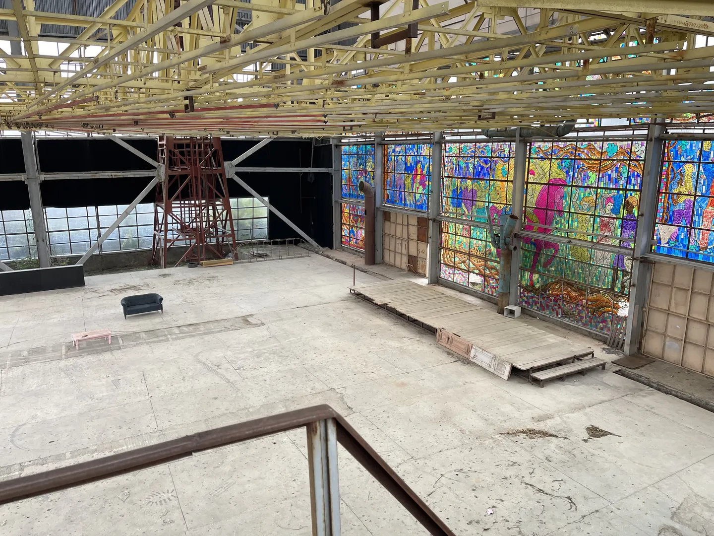
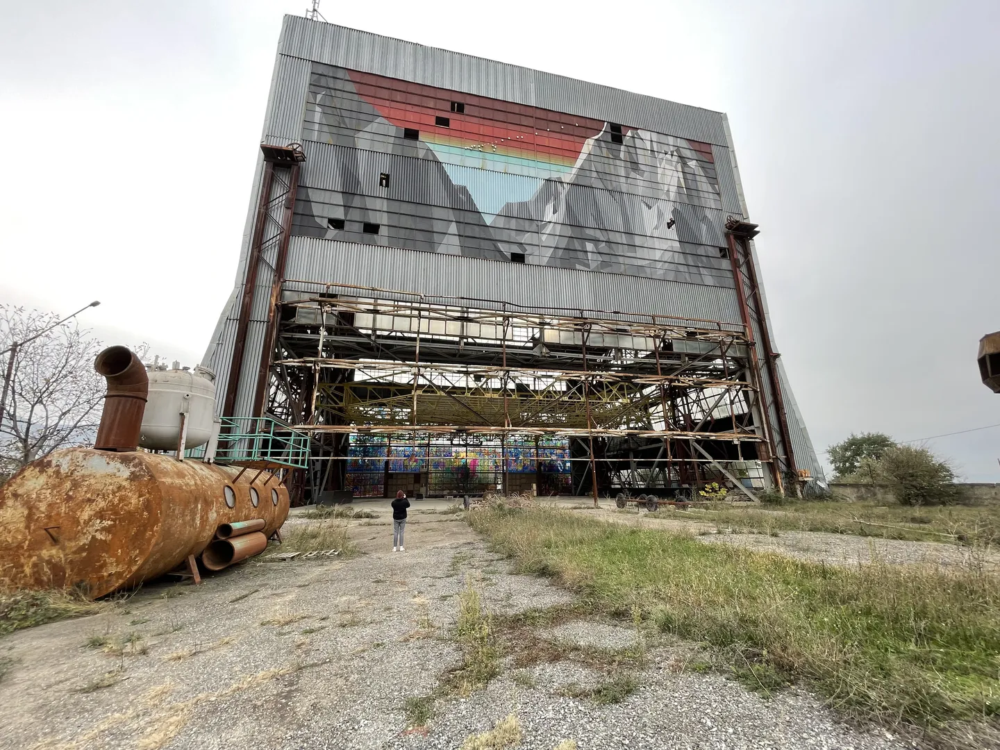
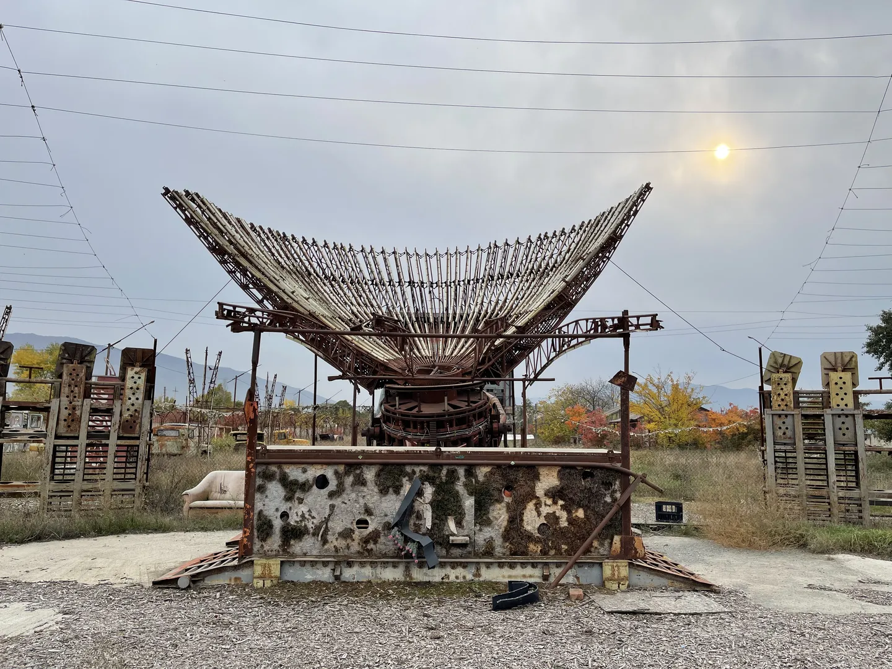
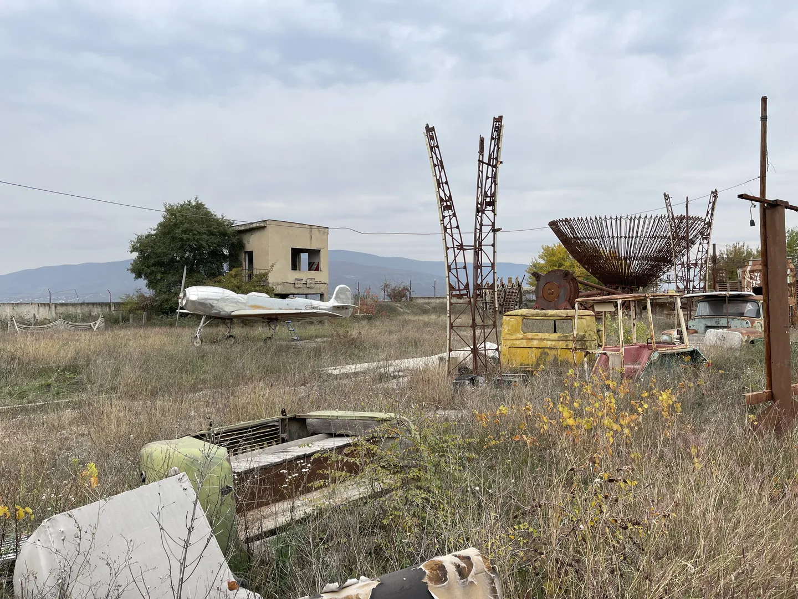
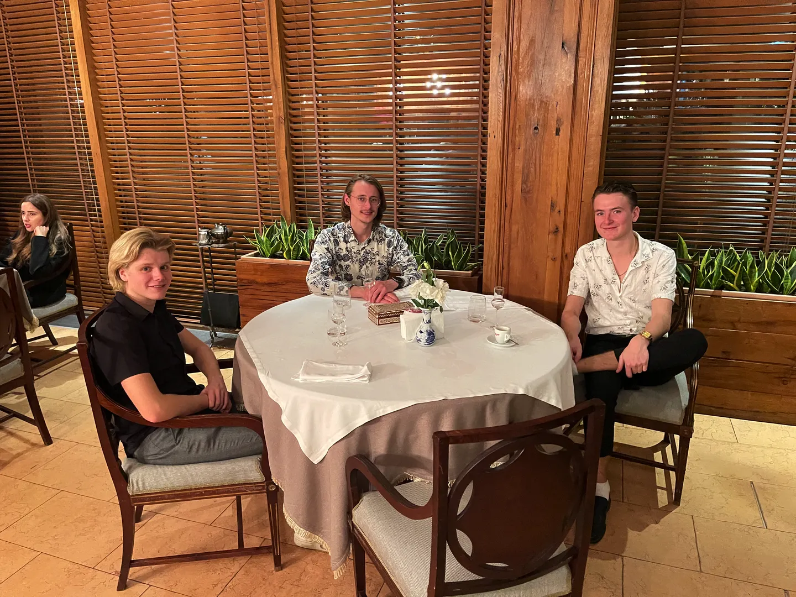
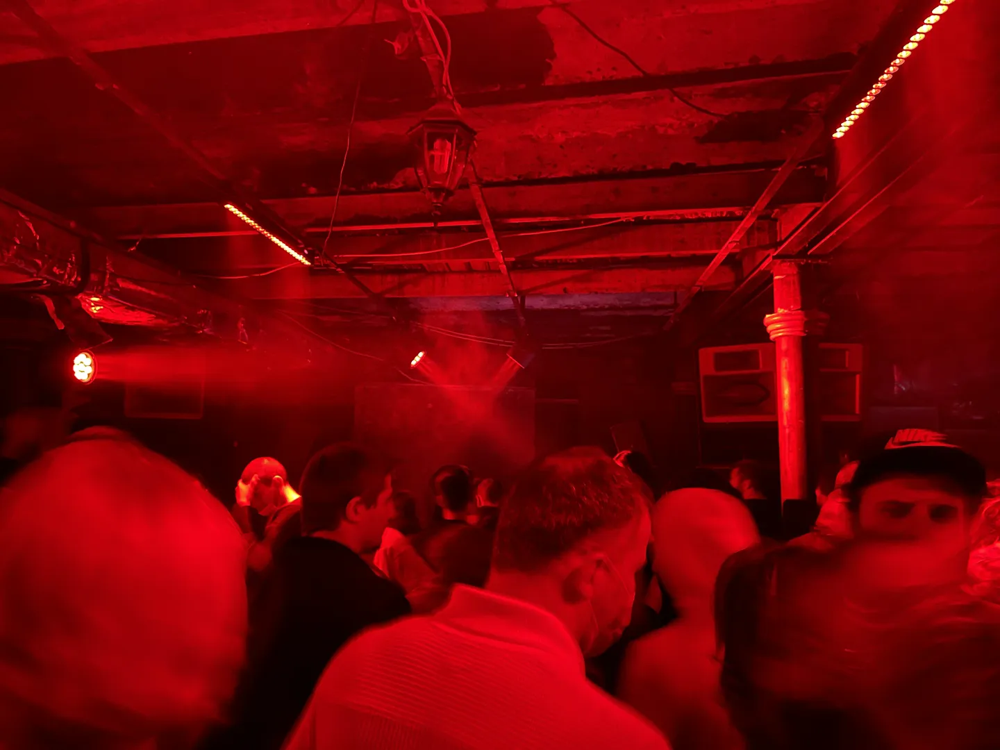

De laatste dag! Dus veel op de planning. 's Ochtends heb ik mijn laatste rondje door de stad gemaakt. Op de Dry Bridge Market heb ik nog een oud sovjet bordje gevonden met daarop 'Stop! Levensgevaar!'. Leuk voor in de gang thuis.

's Middags heb ik Rikus opgehaald met Sven met de Lada, om naar een verlaten sovjet ruimtevaartonderzoeksinstituut te gaan. Hier heb ik een aantal foto's van gevonden op internet. Na een zoektocht op de kaart vond ik de locatie hiervan op ongeveer 45 minuten rijden van Tblisi. Dat leek ons nog erg leuk om te bezoeken. De laatste drie kilometer van de rit waren erg ruig, we moesten over een grintpad rijden wat nogal spannend was met de Lada. Eenmaal daar aangekomen bleek het niet helemaal verlaten te zijn. In het huisje naast de poort bleek iemand ingetrokken te zijn. Enige voorzichtigheid was dus geboden en we zijn iets verderop stiekem over het hek geklommen. De foto bovenaan de pagina laat het aangezicht zien van deze ruïne.

Op dit terrein zat in de sovjettijd een onderzoeksinstituut gevestigd. Helaas kon ik er niet veel over terug vinden op internet. Wel weet ik dat hier een aantal jaar geleden een festival is geweest, waardoor niet alles meer in dezelfde staat is gebleven. Zo zijn er veel schilderingen aangebracht en is een hoop rommel en attributen van het festival blijven staan. Dat neemt niet weg dat het bijzonder is om dit stiekem even te ontdekken.

Ik wilde de jongens graag nog bedanken voor de gastvrijheid en het avontuur van de afgelopen twee weken. Daarom ben ik op zoek gegaan naar de chiqueste restaurants van het land. Door de lage prijzen is dat zelfs voor mij betaalbaar! De keuze is gevallen op het restaurant van het Vinotel, een heel oud hotel in de oude binnenstad van Tblisi. We hebben daar echt onwijs lekker gegeten. We hadden twee obers en een sommelier, goede service, drie gangen en heerlijke wijn. Desondanks was ik iets meer dan honderd euro kwijt voor ons drieën. Een aanrader dus!

Om de dag af te sluiten zijn we naar een feest geweest in de stad. Op ongeveer vijftien minuten lopen vanaf ons appartement moesten we een soort metro-ingang betreden, om daar een oude wijnkelder te betreden. Het was er heel donker en het geluid stond loeihard. Ik moet zeggen dat ze in Georgië heel goed weten hoe je een feestje moet geven. De tijd vloog voorbij en om half vier zijn we teruggelopen naar het appartement. Hier heb ik Sven en Rikus een dikke knuffel gegeven en een taxi gepakt naar het vliegveld. Dit was een vakantie om nooit te vergeten.

Ik wil iedereen bedanken voor het lezen van mijn blog tijdens mijn reis. De leuke reacties die ik heb gekregen maakte dat ik door bleef schrijven. Bedankt!
